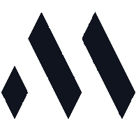

    
    <h1>Foodz - Project Thema 4</h1>
    
My portfolio website where you can see my recent projects, about me, my CV and contact me!

    <a href="https://markiesch.github.io/portfolio/">View Website</a>
    ·
    <a href="https://github.com/Markiesch/portfolio/issues">Report Bug</a>
    ·
    <a href="https://github.com/Markiesch/portfolio/issues">Request Feature</a>

 
 
 

    <iframe style="width: 100%; height: 100%; position: absolute; inset: 0;" src="https://markiesch.github.io/portfolio/" title="Portfolio Website"></iframe>

